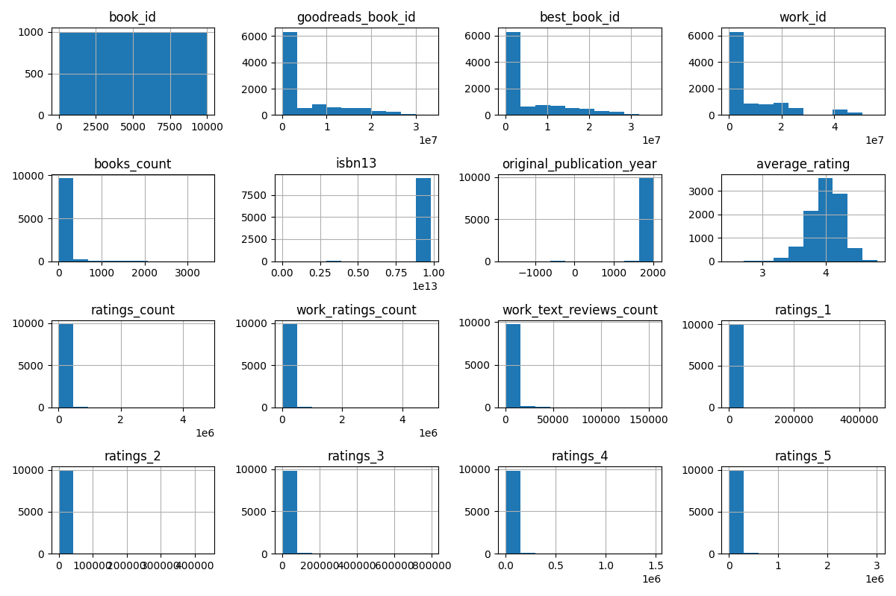
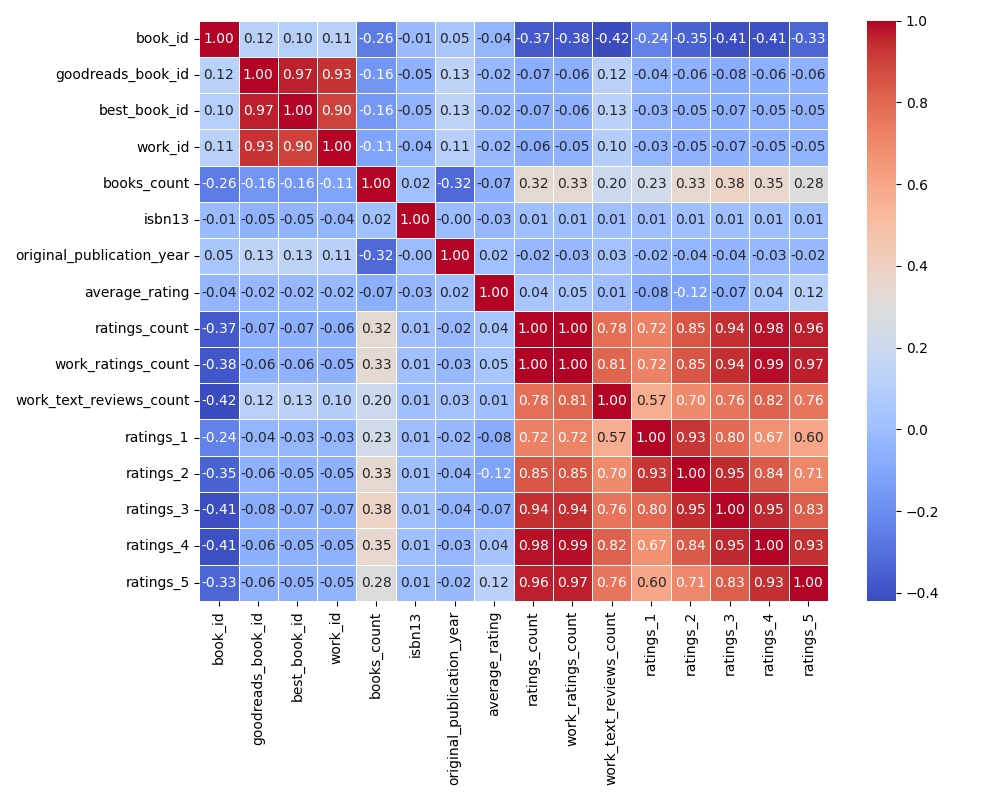
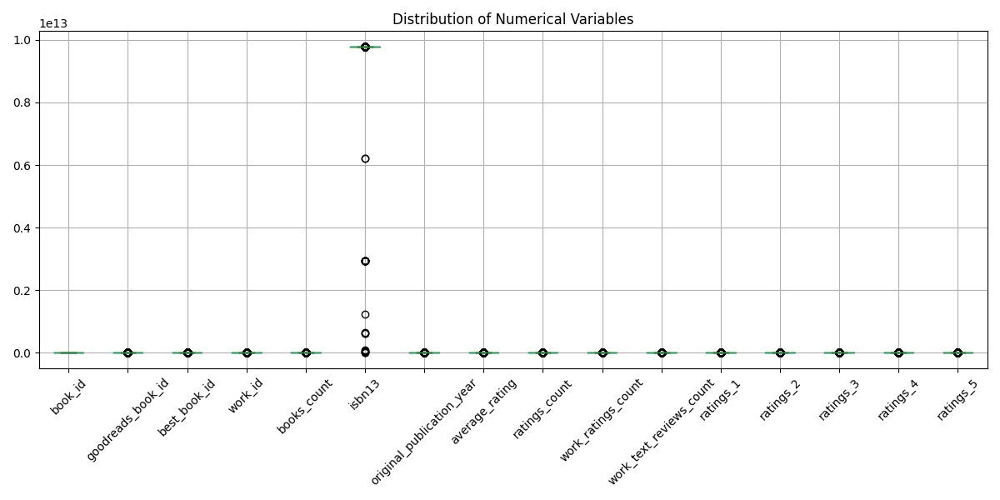

# Automated Data Analysis Report

## Summary of Analysis

### Data Columns: book_id, goodreads_book_id, best_book_id, work_id, books_count, isbn, isbn13, authors, original_publication_year, original_title, title, language_code, average_rating, ratings_count, work_ratings_count, work_text_reviews_count, ratings_1, ratings_2, ratings_3, ratings_4, ratings_5, image_url, small_image_url

### Summary Statistics:
```
            book_id  goodreads_book_id  best_book_id  ...     ratings_5                                          image_url                                    small_image_url
count   10000.00000       1.000000e+04  1.000000e+04  ...  1.000000e+04                                              10000                                              10000
unique          NaN                NaN           NaN  ...           NaN                                               6669                                               6669
top             NaN                NaN           NaN  ...           NaN  https://s.gr-assets.com/assets/nophoto/book/11...  https://s.gr-assets.com/assets/nophoto/book/50...
freq            NaN                NaN           NaN  ...           NaN                                               3332                                               3332
mean     5000.50000       5.264697e+06  5.471214e+06  ...  2.378981e+04                                                NaN                                                NaN
std      2886.89568       7.575462e+06  7.827330e+06  ...  7.976889e+04                                                NaN                                                NaN
min         1.00000       1.000000e+00  1.000000e+00  ...  7.540000e+02                                                NaN                                                NaN
25%      2500.75000       4.627575e+04  4.791175e+04  ...  5.334000e+03                                                NaN                                                NaN
50%      5000.50000       3.949655e+05  4.251235e+05  ...  8.836000e+03                                                NaN                                                NaN
75%      7500.25000       9.382225e+06  9.636112e+06  ...  1.730450e+04                                                NaN                                                NaN
max     10000.00000       3.328864e+07  3.553423e+07  ...  3.011543e+06                                                NaN                                                NaN

[11 rows x 23 columns]
```

### Missing Values:
```
book_id                         0
goodreads_book_id               0
best_book_id                    0
work_id                         0
books_count                     0
isbn                          700
isbn13                        585
authors                         0
original_publication_year      21
original_title                585
title                           0
language_code                1084
average_rating                  0
ratings_count                   0
work_ratings_count              0
work_text_reviews_count         0
ratings_1                       0
ratings_2                       0
ratings_3                       0
ratings_4                       0
ratings_5                       0
image_url                       0
small_image_url                 0
dtype: int64
```

### Correlation Matrix:
```
                            book_id  goodreads_book_id  best_book_id   work_id  books_count  ...  ratings_1  ratings_2  ratings_3  ratings_4  ratings_5
book_id                    1.000000           0.115154      0.104516  0.113861    -0.263841  ...  -0.239401  -0.345764  -0.413279  -0.407079  -0.332486
goodreads_book_id          0.115154           1.000000      0.966620  0.929356    -0.164578  ...  -0.038375  -0.056571  -0.075634  -0.063310  -0.056145
best_book_id               0.104516           0.966620      1.000000  0.899258    -0.159240  ...  -0.033894  -0.049284  -0.067014  -0.054462  -0.049524
work_id                    0.113861           0.929356      0.899258  1.000000    -0.109436  ...  -0.034590  -0.051367  -0.066746  -0.054775  -0.046745
books_count               -0.263841          -0.164578     -0.159240 -0.109436     1.000000  ...   0.225763   0.334923   0.383699   0.349564   0.279559
isbn13                    -0.011291          -0.048246     -0.047253 -0.039320     0.017865  ...   0.006054   0.010345   0.012142   0.010161   0.006622
original_publication_year  0.049875           0.133790      0.131442  0.107972    -0.321753  ...  -0.019635  -0.038472  -0.042459  -0.025785  -0.015388
average_rating            -0.040880          -0.024848     -0.021187 -0.017555    -0.069888  ...  -0.077997  -0.115875  -0.065237   0.036108   0.115412
ratings_count             -0.373178          -0.073023     -0.069182 -0.062720     0.324235  ...   0.723144   0.845949   0.935193   0.978869   0.964046
work_ratings_count        -0.382656          -0.063760     -0.055835 -0.054712     0.333664  ...   0.718718   0.848581   0.941182   0.987764   0.966587
work_text_reviews_count   -0.419292           0.118845      0.125893  0.096985     0.198698  ...   0.572007   0.696880   0.762214   0.817826   0.764940
ratings_1                 -0.239401          -0.038375     -0.033894 -0.034590     0.225763  ...   1.000000   0.926140   0.795364   0.672986   0.597231
ratings_2                 -0.345764          -0.056571     -0.049284 -0.051367     0.334923  ...   0.926140   1.000000   0.949596   0.838298   0.705747
ratings_3                 -0.413279          -0.075634     -0.067014 -0.066746     0.383699  ...   0.795364   0.949596   1.000000   0.952998   0.825550
ratings_4                 -0.407079          -0.063310     -0.054462 -0.054775     0.349564  ...   0.672986   0.838298   0.952998   1.000000   0.933785
ratings_5                 -0.332486          -0.056145     -0.049524 -0.046745     0.279559  ...   0.597231   0.705747   0.825550   0.933785   1.000000

[16 rows x 16 columns]
```

## Data Insights

### Insights and Analysis of Book Ratings Data

The dataset contains information about 10,000 books, capturing various attributes such as IDs, publication years, authors, ratings, and reviews. Below is a detailed story that unpacks the insights derived from the data.

---

#### 1. **Overall Ratings Landscape**

- **Average Rating**: The mean average rating across all books is approximately **4.00** (on a scale of 1 to 5), suggesting that the books in this dataset are generally well-received.
- **Rating Distribution**: The ratings are skewed positively, with a significant number of high ratings (5 stars). The average count of 5-star ratings per book is about **23,790**, indicating that readers tend to favor these books.

#### 2. **Rating Counts and Text Reviews**

- **Ratings Count**: On average, each book has around **54,001** ratings, with a maximum of over **4.78 million** ratings. This indicates that popular books receive a substantial amount of engagement.
- **Work Text Reviews Count**: The average number of text reviews is about **2,920**, with books receiving as many as **155,254** text reviews. This suggests that readers are not only rating books but are also taking the time to provide detailed feedback.

#### 3. **Correlation Insights**

Correlations between attributes provide interesting insights:

- **Ratings and Reviews**: There is a strong correlation (0.995) between the total ratings count and the work ratings count, indicating that the total number of ratings directly influences the work ratings.
- **Ratings Distribution**: The correlation between different rating categories (1 to 5 stars) is also high, suggesting that if a book receives a high number of 5-star ratings, it is also likely to have high counts in lower ratings (4, 3, etc.). This might imply that people's ratings reflect a range of sentiments, even for well-rated books.

#### 4. **Authors and Popularity**

- **Most Frequent Authors**: The dataset reveals that **Stephen King** is the most frequently mentioned author, appearing **60 times**. This suggests his books are not only numerous but also popular within the dataset.
- **Books Count**: The average number of books by an author in the dataset is around **75.71**, with a maximum of **3,455** books. This indicates a diverse range of authors, with some contributing significantly more

## Visualizations

### Histograms


### Correlation Heatmap


### Box Plots


