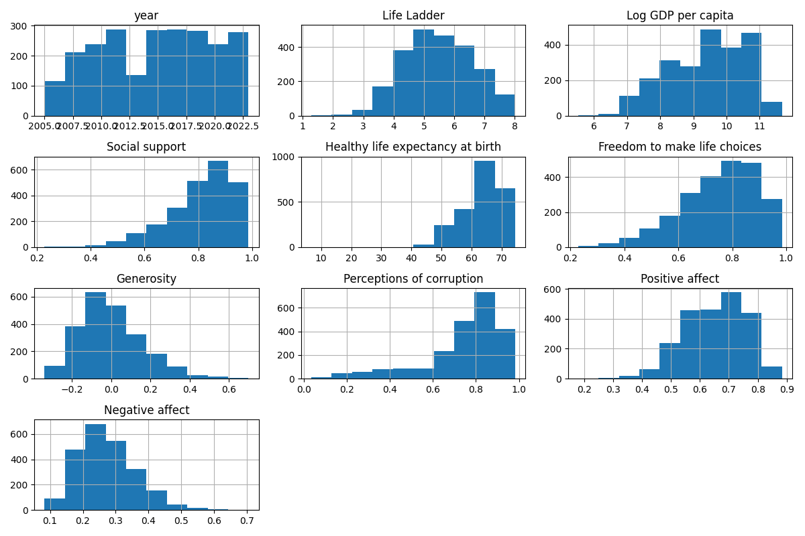
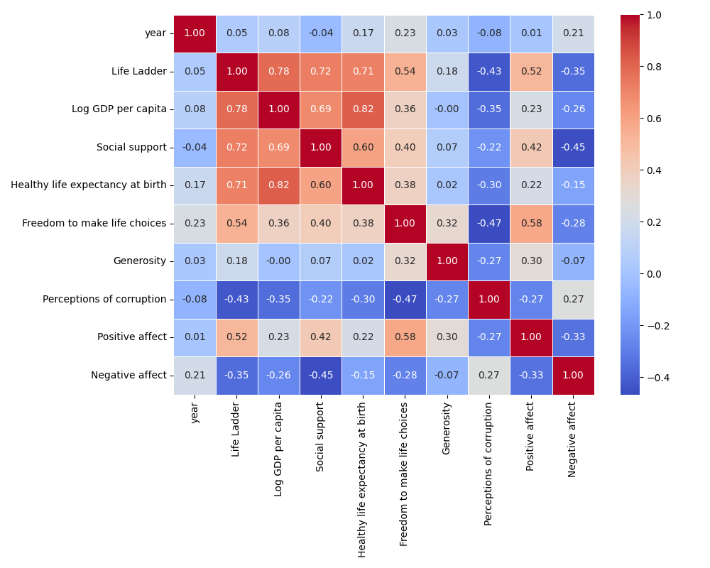
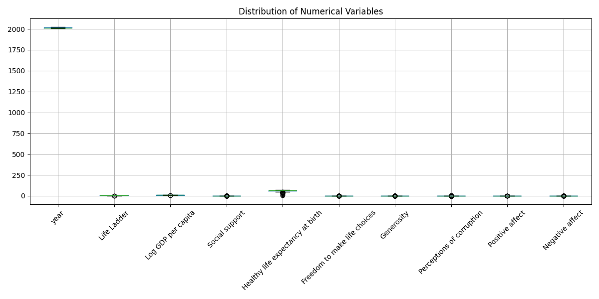

# Automated Data Analysis Report

## Summary of Analysis

### Data Columns: Country name, year, Life Ladder, Log GDP per capita, Social support, Healthy life expectancy at birth, Freedom to make life choices, Generosity, Perceptions of corruption, Positive affect, Negative affect

### Summary Statistics:
```
       Country name         year  Life Ladder  Log GDP per capita  ...   Generosity  Perceptions of corruption  Positive affect  Negative affect
count          2363  2363.000000  2363.000000         2335.000000  ...  2282.000000                2238.000000      2339.000000      2347.000000
unique          165          NaN          NaN                 NaN  ...          NaN                        NaN              NaN              NaN
top       Argentina          NaN          NaN                 NaN  ...          NaN                        NaN              NaN              NaN
freq             18          NaN          NaN                 NaN  ...          NaN                        NaN              NaN              NaN
mean            NaN  2014.763860     5.483566            9.399671  ...     0.000098                   0.743971         0.651882         0.273151
std             NaN     5.059436     1.125522            1.152069  ...     0.161388                   0.184865         0.106240         0.087131
min             NaN  2005.000000     1.281000            5.527000  ...    -0.340000                   0.035000         0.179000         0.083000
25%             NaN  2011.000000     4.647000            8.506500  ...    -0.112000                   0.687000         0.572000         0.209000
50%             NaN  2015.000000     5.449000            9.503000  ...    -0.022000                   0.798500         0.663000         0.262000
75%             NaN  2019.000000     6.323500           10.392500  ...     0.093750                   0.867750         0.737000         0.326000
max             NaN  2023.000000     8.019000           11.676000  ...     0.700000                   0.983000         0.884000         0.705000

[11 rows x 11 columns]
```

### Missing Values:
```
Country name                          0
year                                  0
Life Ladder                           0
Log GDP per capita                   28
Social support                       13
Healthy life expectancy at birth     63
Freedom to make life choices         36
Generosity                           81
Perceptions of corruption           125
Positive affect                      24
Negative affect                      16
dtype: int64
```

### Correlation Matrix:
```
                                      year  Life Ladder  Log GDP per capita  Social support  ...  Generosity  Perceptions of corruption  Positive affect  Negative affect
year                              1.000000     0.046846            0.080104       -0.043074  ...    0.030864                  -0.082136         0.013052         0.207642
Life Ladder                       0.046846     1.000000            0.783556        0.722738  ...    0.177398                  -0.430485         0.515283        -0.352412
Log GDP per capita                0.080104     0.783556            1.000000        0.685329  ...   -0.000766                  -0.353893         0.230868        -0.260689
Social support                   -0.043074     0.722738            0.685329        1.000000  ...    0.065240                  -0.221410         0.424524        -0.454878
Healthy life expectancy at birth  0.168026     0.714927            0.819326        0.597787  ...    0.015168                  -0.303130         0.217982        -0.150330
Freedom to make life choices      0.232974     0.538210            0.364816        0.404131  ...    0.321396                  -0.466023         0.578398        -0.278959
Generosity                        0.030864     0.177398           -0.000766        0.065240  ...    1.000000                  -0.270004         0.300608        -0.071975
Perceptions of corruption        -0.082136    -0.430485           -0.353893       -0.221410  ...   -0.270004                   1.000000        -0.274208         0.265555
Positive affect                   0.013052     0.515283            0.230868        0.424524  ...    0.300608                  -0.274208         1.000000        -0.334451
Negative affect                   0.207642    -0.352412           -0.260689       -0.454878  ...   -0.071975                   0.265555        -0.334451         1.000000

[10 rows x 10 columns]
```

## Data Insights

The dataset provided offers a rich tapestry of insights into the factors influencing happiness and well-being across various countries from 2005 to 2023. With 2363 observations across 165 unique countries, this analysis delves into the relationships among key indicators such as life satisfaction (Life Ladder), economic prosperity (Log GDP per capita), social support, health, freedom, generosity, perceptions of corruption, and emotional well-being (positive and negative affect).

### Overview of the Data

1. **Temporal Scope**: The data spans nearly two decades, with a mean year of approximately 2014. This allows us to observe trends over time and how various factors have changed.
  
2. **Core Metrics**: The Life Ladder score, which reflects individuals' life satisfaction on a scale from 0 to 10, has a mean of about 5.48, indicating moderate levels of life satisfaction. The Log GDP per capita averages around 9.4, suggesting a generally positive economic condition among the surveyed countries.

3. **Social and Health Indicators**: 
   - Social support averages 0.81, indicating a relatively high level of community and societal backing.
   - Healthy life expectancy at birth is around 63.4 years, reflecting varying health outcomes across nations.
   - Freedom to make life choices has a mean of 0.75, denoting a favorable level of personal autonomy.

4. **Emotional Well-Being**: 
   - The average positive affect score is approximately 0.65, while negative affect averages 0.27, suggesting that, on balance, individuals tend to experience more positive emotions than negative ones.

5. **Corruption and Generosity**: Perceptions of corruption average at 0.74, indicating a significant concern about corruption in many countries, while generosity appears lower, with a mean close to zero.

### Key Insights

#### Economic Impact on Happiness

A strong positive correlation (0.78) exists between Life Ladder scores and Log GDP per capita, suggesting that wealthier nations tend to report higher life satisfaction. This aligns with the understanding that economic resources can significantly enhance quality of life through better services, healthcare, and overall living conditions.

#### Role of Social Support

Social support also shows a robust correlation (0.72) with happiness. Countries that foster strong community bonds and provide robust social networks tend to see higher life satisfaction. This suggests that emotional well-being is not solely reliant on economic factors but is significantly influenced by the

## Visualizations

### Histograms


### Correlation Heatmap


### Box Plots


