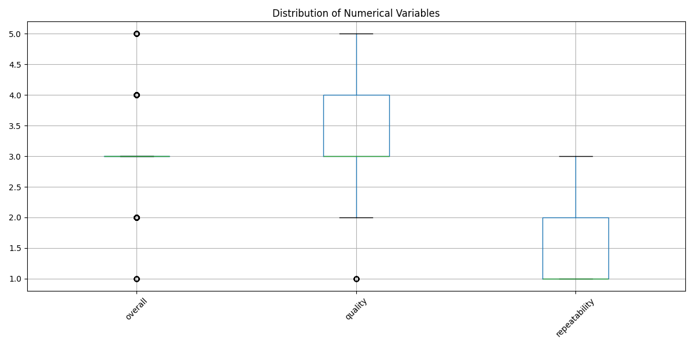

# Automated Data Analysis Report

## Summary of Analysis

### Data Columns: date, language, type, title, by, overall, quality, repeatability

### Summary Statistics:
```
             date language   type              title                 by      overall      quality  repeatability
count        2553     2652   2652               2652               2390  2652.000000  2652.000000    2652.000000
unique       2055       11      8               2312               1528          NaN          NaN            NaN
top     21-May-06  English  movie  Kanda Naal Mudhal  Kiefer Sutherland          NaN          NaN            NaN
freq            8     1306   2211                  9                 48          NaN          NaN            NaN
mean          NaN      NaN    NaN                NaN                NaN     3.047511     3.209276       1.494721
std           NaN      NaN    NaN                NaN                NaN     0.762180     0.796743       0.598289
min           NaN      NaN    NaN                NaN                NaN     1.000000     1.000000       1.000000
25%           NaN      NaN    NaN                NaN                NaN     3.000000     3.000000       1.000000
50%           NaN      NaN    NaN                NaN                NaN     3.000000     3.000000       1.000000
75%           NaN      NaN    NaN                NaN                NaN     3.000000     4.000000       2.000000
max           NaN      NaN    NaN                NaN                NaN     5.000000     5.000000       3.000000
```

### Missing Values:
```
date              99
language           0
type               0
title              0
by               262
overall            0
quality            0
repeatability      0
dtype: int64
```

### Correlation Matrix:
```
                overall   quality  repeatability
overall        1.000000  0.825935       0.512600
quality        0.825935  1.000000       0.312127
repeatability  0.512600  0.312127       1.000000
```

## Data Insights

### Insights and Story from the Data Analysis

The dataset comprises 2,652 entries with various attributes related to media content, specifically focusing on films and possibly television shows. The key columns include the date of release, language, type (most notably movies), title, the creator or actor involved, and ratings based on overall quality and repeatability.

#### Data Overview

1. **Temporal Distribution**: 
   - The dataset spans a significant period with a total of 2,553 dates recorded, though there are 99 missing entries. The most frequently occurring date is 21-May-06, which suggests a peak or notable event during that period.

2. **Language Diversity**: 
   - There are 11 unique languages represented in the dataset, with English being the most prevalent (1,306 occurrences). This indicates a strong market presence of English-language films, which could suggest the dataset's primary focus on films that cater to the English-speaking audience.

3. **Type of Content**: 
   - The dataset predominantly consists of movies (2,211 entries), which is roughly 83% of the total. This underscores the emphasis on film analysis rather than other types of media (the other 17% likely includes TV shows or miniseries).

4. **Title Frequency**: 
   - The title "Kanda Naal Mudhal" stands out with 9 occurrences, indicating it's either a popular title or a series of related films, which may warrant further exploration into its success or thematic relevance.

5. **Creators**: 
   - Kiefer Sutherland emerges as the most frequently credited individual (48 occurrences). This could imply a significant involvement in high-profile projects, or the possibility of his work appealing to audiences. 

#### Ratings Analysis

1. **Overall Ratings**: 
   - The mean rating across all entries is approximately 3.05 out of 5, with a standard deviation of about 0.76. This suggests a moderate average satisfaction level among viewers, with most ratings clustering around the middle of the scale.

2. **Quality Ratings**: 
   - Quality ratings have a slightly higher average of approximately 3.21, indicating that users perceive the quality of content to be marginally better than their overall experience. This could suggest that while films are enjoyable, there may be factors affecting their overall appeal (such as plot, acting, or production quality).

3. **Repeatability Ratings**: 
   - The repeatability score

## Visualizations

### Histograms


### Correlation Heatmap


### Box Plots


